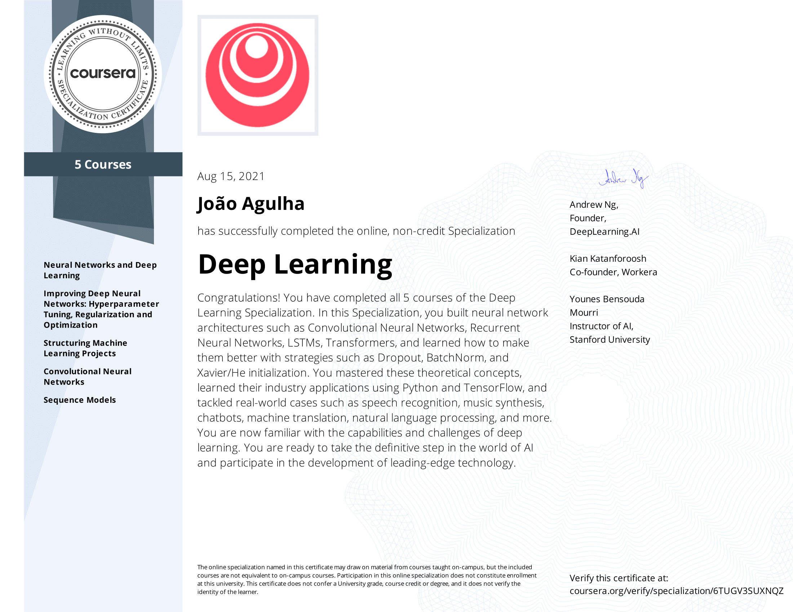

# DeepLearning.ai | Deep Learning Specialization

This repository contains my personal code and respective certificates for each individual course, as well as, for the specialization itself. 

[DeepLearning.ai](https://deeplearning.ai)  contains five courses which can be taken on [Coursera](https://www.coursera.org/specializations/deep-learning). The five courses titles are:

1. Neural Networks and Deep Learning.
2. Improving Deep Neural Networks: Hyperparameter tuning, Regularization and Optimization.
3. Structuring Machine Learning Projects.
4. Convolutional Neural Networks.
5. Sequence Models.

I've enjoyed every part of the course, and, in my opinion, it is by far the best one on deep learning that I've experienced.

## About this specialization (take from the official Deep Learning Specialization web page)

> If you want to break into AI, this Specialization will help you do so. Deep Learning is one of the most highly sought after skills in tech. We will help you become good at Deep Learning.
>
> In five courses, you will learn the foundations of Deep Learning, understand how to build neural networks, and learn how to lead successful machine learning projects. You will learn about Convolutional networks, RNNs, LSTM, Adam, Dropout, BatchNorm, Xavier/He initialization, and more. You will work on case studies from healthcare, autonomous driving, sign language reading, music generation, and natural language processing. You will master not only the theory, but also see how it is applied in industry. You will practice all these ideas in Python and in TensorFlow, which we will teach.
>
> You will also hear from many top leaders in Deep Learning, who will share with you their personal stories and give you career advice.
>
> AI is transforming multiple industries. After finishing this specialization, you will likely find creative ways to apply it to your work.
>
> We will help you master Deep Learning, understand how to apply it, and build a career in AI.

## Certificate

At last, I've successfully completed the specialization and earned my certificate.

